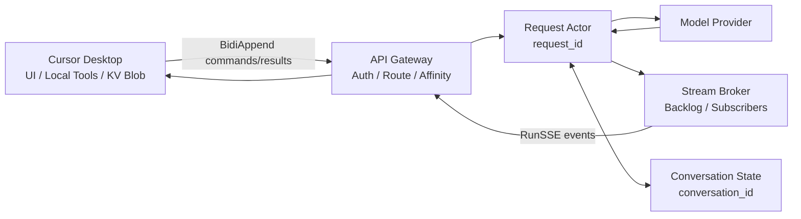

# BidiAppend / RunSSE 原服务架构推断

本文根据实际抓包、已提取的 protobuf 定义以及同一 `conversation_id` 下的消息关联关系，分析 Cursor Agent 原服务采用的通信技术、运行方式和可能的服务架构。

本文只描述协议事实和架构推断，不描述当前项目的实现方案。

## 1. 分析样本

本次分析使用以下会话：

```text
conversation_id: 9b31772c-35fe-4b51-a862-c177749854af
```

最初分析快照包含两个独立 turn；随后该会话又新增第三个 turn。以下表格保留最初两轮的详细帧统计，第三轮的 KV 细节在 KV 专项文档中单独记录：

| Turn | `request_id` | RunSSE 时长 | RunSSE 帧数 | 上行消息 |
| --- | --- | ---: | ---: | --- |
| 1 | `2faaa6b5-6ad7-4428-85f7-8cfc0cb3e52e` | 24,128 ms | 24 | 1 个 `run_request`、4 个 heartbeat、9 个 KV 响应 |
| 2 | `feac27a2-3baf-4153-b009-2809dc9d4cf2` | 3,294 ms | 24 | 1 个 `run_request`、8 个 KV 响应 |

两个 turn 使用相同的 `conversation_id`，但分别使用新的 `request_id`。这说明 `conversation_id` 表示跨 turn 的持久会话，而 `request_id` 表示一次活动请求流或一次 turn 的运行实例。

## 2. 核心结论

该通信方式可以概括为：

> Connect RPC + Protobuf 实现的 split-duplex streaming，上层运行 request 维度的 Agent Actor / Workflow 状态机。

它不是 WebSocket，也不是标准 gRPC 双向流。虽然 RunSSE 响应头使用 `text/event-stream`，但正文不是传统 SSE 的 `data:` 文本事件，而是 Connect 的二进制流式帧。

从应用语义看，它将逻辑双向流拆成两个方向相反的 HTTP 通道：

- `BidiAppend`：客户端通过多个 unary RPC 向服务端发送命令、心跳和本地执行结果。
- `RunSSE`：服务端通过一条 server-streaming RPC 向客户端发送增量事件、工具请求、状态 checkpoint 和流终态。

两条通道通过相同的 `request_id` 关联，共同构成应用层的双向通信。

## 3. 传输技术

### 3.1 Connect RPC

抓包中的请求头包含：

```text
Connect-Protocol-Version: 1
User-Agent: connect-es/1.6.1
```

这说明桌面客户端的协议调用层使用 Connect-ES。它很可能运行在 Cursor 的 Electron / VS Code JavaScript 环境中。

`BidiAppend` 使用：

```text
Content-Type: application/proto
```

这是一个 protobuf unary RPC。每次请求只追加一条 `AgentClientMessage`，服务端返回空的 `BidiAppendResponse` 作为接收确认。

`RunSSE` 请求使用：

```text
Content-Type: application/connect+proto
Connect-Accept-Encoding: gzip
Connect-Content-Encoding: gzip
```

响应使用：

```text
Content-Type: text/event-stream
Connect-Content-Encoding: gzip
```

`text/event-stream` 在这里是兼容性响应类型，实际正文仍使用 Connect 二进制 envelope。因此不能使用标准 EventSource 文本解析器处理该响应。

### 3.2 Connect 流式帧

每个 RunSSE 消息使用以下帧结构：

```text
+------------+----------------------+--------------------+
| flags: 1B  | length: uint32 BE    | payload: length B  |
+------------+----------------------+--------------------+
```

已观察到的 flags：

| flags | 功能 |
| --- | --- |
| `0x00` | 未压缩的 protobuf 数据帧 |
| `0x01` | 压缩的数据帧 |
| `0x02` | EndStream 终态帧 |

小型 heartbeat 和 token 增量通常使用 `0x00`，体积较大的 KV 或 checkpoint 消息可能使用 `0x01`。两个样本的最后一帧都是 `0x02`。

底层连接可以运行在 HTTP/1.1 chunked response 或 HTTP/2 stream 上。当前抓包不足以确定客户端到原服务实际使用了哪一个 HTTP 版本。

## 4. 一次 Turn 的运行时序

抓包顺序表明客户端通常先建立 RunSSE，再通过 BidiAppend 发送 `run_request`。这样可以在启动 Agent Run 之前准备好下行订阅，避免遗漏早期事件。

```mermaid
sequenceDiagram
    participant Client as Cursor Client
    participant Gateway as API Gateway
    participant Actor as Request Actor
    participant Provider as Model Provider

    Client->>Gateway: RunSSE(request_id)
    Gateway->>Actor: Subscribe(request_id)
    Client->>Gateway: BidiAppend(run_request)
    Gateway->>Actor: Start turn
    Actor->>Provider: Start model call
    Provider-->>Actor: Thinking / token / tool deltas
    Actor-->>Client: AgentServerMessage stream
    Actor-->>Client: KV / Exec / Interaction request
    Client->>Actor: BidiAppend(result, append_seqno)
    Actor->>Provider: Resume with external result
    Actor-->>Client: Conversation checkpoint
    Actor-->>Client: EndStream
```

完整生命周期为：

1. 客户端生成本次 turn 的 `request_id`。
2. 客户端使用 `BidiRequestId` 建立 RunSSE 下行流。
3. 客户端通过 BidiAppend 发送 `run_request`。
4. 服务端启动模型调用并持续发送 `thinking_delta`、`text_delta`、`token_delta` 和 step 状态。
5. 服务端需要客户端能力时，通过 RunSSE 发送 KV、Exec 或 Interaction 请求。
6. 客户端执行本地操作，并通过 BidiAppend 返回对应结果。
7. 服务端根据外部结果继续模型循环，或者进入 turn 收口阶段。
8. 服务端同步 checkpoint 及其 blob。
9. 服务端发送 EndStream，结束本次 `request_id` 对应的流。

## 5. 上行顺序与幂等语义

`BidiAppendRequest.append_seqno` 是同一个 `request_id` 内的有序序号。

第一个 turn 中观察到：

```text
run_request       append_seqno = 0（字段使用默认值）
client_heartbeat  append_seqno = 1..4
kv_client_message append_seqno = 5..13
```

KV 响应对应的 HTTP 请求在抓包记录中并不完全按照序号排列，说明客户端可能并发发起多个 BidiAppend 请求。服务端必须按 `append_seqno` 排序、串行处理或拒绝过期消息，不能依赖 HTTP 请求的到达顺序。

因此 `append_seqno` 至少承担以下功能：

- 确定同一个请求流内的命令顺序。
- 识别重复提交或重试。
- 在多个并发 unary 请求之间恢复确定性处理顺序。

它不是整个 conversation 的全局序号。新的 `request_id` 可以重新从较小的序号开始。

## 6. 标识符与状态边界

### 6.1 `conversation_id`

`conversation_id` 是跨 turn 的持久会话标识。它关联历史消息、checkpoint、token 状态、模式以及 workspace 元数据。

样本中的第二个 `run_request` 已携带第一轮产生的 `conversation_state`，证明 conversation 状态会跨 `request_id` 延续。

### 6.2 `request_id`

`request_id` 是活动流、一次 turn 或一次运行尝试的路由键。它同时出现在：

- RunSSE 订阅请求中。
- BidiAppend 外层请求中。
- `X-Request-Id` HTTP 请求头中。
- 本次 turn 的服务端事件和客户端结果关联关系中。

服务端需要以 `request_id` 找到正在运行的 Actor、事件 backlog、订阅者以及待处理的工具调用。

### 6.3 `run_id`

本次两个样本中的 `run_id` 与各自的 `request_id` 相同，但协议中它们是独立字段。架构设计不应假定两者永久等值：

- `request_id` 偏向传输和活动流路由。
- `run_id` 偏向 Agent 执行实例。

### 6.4 KV `id`

`KvServerMessage.id` 与 `KvClientMessage.id` 构成一次服务端到客户端 RPC 的关联键。它与 `append_seqno` 的职责不同：

- KV `id` 关联某个具体请求和响应。
- `append_seqno` 规定所有上行消息的处理顺序。

## 7. Checkpoint 与 Blob 同步

协议中的 KV 虽然以 Key-Value 命名，但它表达的不是普通配置项或业务数据库。它更接近一个由客户端提供的内容寻址 Blob Store（Content-Addressable Store，CAS），用于保存和恢复 conversation checkpoint 的组成部分。

### 7.1 KV 消息语义

服务端通过 RunSSE 发起 KV 操作：

| 消息 | 参数 | 功能 |
| --- | --- | --- |
| `get_blob_args` | `blob_id` | 要求客户端返回此前保存的 Blob。 |
| `set_blob_args` | `blob_id`、`blob_data` | 要求客户端保存指定 Blob。 |

客户端通过 BidiAppend 返回操作结果：

| 消息 | 参数 | 功能 |
| --- | --- | --- |
| `get_blob_result` | `blob_data` 或 `error` | 返回 Blob 内容或读取错误。 |
| `set_blob_result` | 可选 `error` | 确认保存成功，或返回写入错误。 |

KV 消息中存在两类用途不同的 ID：

- `KvServerMessage.id`：本次 KV 操作的临时流水号，客户端使用相同值返回 `KvClientMessage`。
- `blob_id`：Blob 内容的稳定地址，用来在 checkpoint 和其他协议消息中引用内容。

对该会话中全部 16 个 `set_blob_args` 进行校验后，每一个 `blob_id` 都精确等于对应 `blob_data` 的 SHA-256。由此可以确认这里使用的是内容寻址，而不是随机生成的 KV key：

```text
blob_id = SHA-256(blob_data)
```

相同内容必然得到相同 `blob_id`，内容发生任何改变都会生成新的 ID。因此 Blob 可以被视为不可变对象，重复写入同一 Blob 也天然具有幂等性。

### 7.2 Blob 表达的内容

Blob 主要承载 conversation checkpoint 中体积较大、可以独立复用的 protobuf 节点，例如：

- 用户消息。
- Thinking、Assistant Message 和 ToolCall 等 conversation step。
- Conversation turn。
- Prompt context usage snapshot。
- Rules、Skills、Subagents、MCP 等大型请求上下文。
- 其他通过 `blob_id`、`data_blob_id` 或 `content_blob_id` 引用的二进制内容。

Checkpoint 本身更接近一个引用清单。会话历史可以形成如下内容寻址对象图：

```text
ConversationStateStructure
  └─ turns[]: blob_id
       └─ ConversationTurnStructure
            ├─ user_message: blob_id
            └─ steps[]: blob_id
                 ├─ ThinkingMessage
                 ├─ AssistantMessage
                 └─ ToolCall
```

顶层 checkpoint 不必反复内嵌完整历史，只需要保存根引用。Turn Blob 再引用 UserMessage Blob 和多个 Step Blob。这种结构类似一棵由 SHA-256 连接的不可变 Merkle DAG。

### 7.3 写入与读取流程

Turn 结束或状态发生重要变化时，Blob 写入流程为：

1. 服务端将用户消息、conversation step 和 turn 等节点分别序列化。
2. 服务端对每个序列化结果计算 SHA-256，得到 `blob_id`。
3. 服务端通过 RunSSE 发送 `set_blob_args`。
4. 客户端保存 Blob，并通过 BidiAppend 返回 `set_blob_result`。
5. 必要 Blob 全部确认后，服务端发送引用这些 Blob 的 `conversation_checkpoint_update`。
6. 服务端完成本次 turn 并发送 EndStream。

下一轮恢复状态时，Blob 读取流程通常为：

1. 客户端将上一轮 checkpoint 随 `run_request` 发回。
2. 服务端读取 checkpoint 和 `request_context_parts` 中的 Blob 引用。
3. 服务端按需通过 RunSSE 发送 `get_blob_args` 请求自己当前缺少的内容。
4. 客户端通过 BidiAppend 返回 `get_blob_result`。
5. 服务端使用已持有或刚读取的 Blob 恢复所需上下文并继续运行。

注意：本次样本中的 `get_blob_args` 实际读取的是 `request_context_parts.mcps_blob_id`，不是 `conversation_state.turns[]` 的 Turn Blob。样本没有直接证明服务端会在每个新 turn 中重新读取历史 Turn Blob；服务端可能已经保存或缓存了这些内容。

### 7.4 当前会话中的证据

第一个 turn：

- 服务端通过 RunSSE 发送 9 个 `set_blob_args`。
- 客户端通过 BidiAppend 返回 9 个 `set_blob_result`。
- 服务端随后发送 `conversation_checkpoint_update`。

第二个 turn：

- `run_request` 已携带上一轮 `conversation_state`。
- 服务端先读取 29,974 字节的 `mcps_blob_id`，客户端返回 `get_blob_result`。
- 服务端再发送 7 个 `set_blob_args`，客户端逐一确认。
- 服务端发送新的 checkpoint，然后结束流。

后续第三个 turn：

- 服务端读取 59,145 字节的新 `mcps_blob_id`。
- 服务端发送 14 个 `set_blob_args`，客户端逐一确认。

这两次 `get_blob_result` 的返回数据都与请求的 `blob_id` 通过 SHA-256 校验一致。

该顺序说明 KV 同步不是与 conversation 无关的后台缓存。它直接参与 checkpoint 提交和 turn 收口：服务端先确保必要内容能够被客户端读取，再发布引用这些内容的状态清单。

### 7.5 KV 的架构作用

该设计提供以下能力：

- **缩小 checkpoint**：主状态只携带引用，不必每轮重复传输完整历史。
- **内容去重**：未变化的消息、step 或 turn 使用相同 SHA-256，只需保存一次。
- **幂等写入**：相同 `blob_id` 永远对应相同内容，重复 `set_blob` 不会产生语义冲突。
- **按需加载**：服务端可以只读取当前恢复流程需要的 Blob；当前样本明确观察到的是 MCP 请求上下文按需读取。
- **跨 Worker 恢复**：新的 Agent Worker 可以根据客户端携带的 checkpoint 和 Blob 恢复上下文，不必依赖原进程内存。
- **避免悬空引用**：客户端确认 Blob 已保存后，服务端才发布最终 checkpoint。
- **客户端状态参与**：本地客户端不仅执行工具，也充当 Agent 会话对象存储协议的一部分。

由此可以确认：

- checkpoint 元数据可以由客户端携带到下一轮。
- 较大的 checkpoint 内容使用内容寻址 Blob 拆分。
- 客户端至少承担 Blob 存取接口或本地 Blob 缓存的角色。
- 服务端会等待必要 Blob 写入得到确认，再完成 checkpoint 和 turn 收口。

KV 的本质因此不是“保存几个键值”，而是客户端侧的 Agent 会话对象存储协议。它与 checkpoint 一起构成“客户端携带状态 + 内容寻址 Blob 同步”的混合状态模型。

抓包不能证明服务端完全不保存这些数据，也不能证明其设计目的包含隐私或数据本地化；它只能证明客户端是状态协议中的实际参与者，而不是薄 UI。

## 8. 原服务的逻辑架构



### 8.1 客户端：本地执行面

客户端负责：

- IDE 和 UI 交互。
- 本地文件、终端、编辑器及其他环境能力。
- 接收服务端的 Exec、KV 和 Interaction 请求。
- 执行本地操作并回传结果。
- 携带 conversation checkpoint，并参与 blob 存取。
- 维护上行 `append_seqno` 和连接心跳。

### 8.2 云端：控制面与推理编排器

服务端负责：

- 接收 `run_request` 并创建或恢复 turn。
- 编排模型 provider 调用。
- 将 provider 增量转换为 `AgentServerMessage`。
- 管理等待中的本地工具、KV 和用户交互请求。
- 根据外部结果恢复模型循环。
- 生成 checkpoint，并协调 blob 写入确认。
- 发布终态并结束 RunSSE。

因此原服务更接近 Agent workflow orchestrator，而不是一个简单的聊天补全 API。

### 8.3 Request Actor / Workflow

每个活动 `request_id` 很可能对应一个串行状态实例，可抽象为 Actor 或 workflow：

```text
created
  -> provider_running
  -> waiting_external / awaiting_user
  -> provider_running
  -> checkpointing
  -> completed / failed / canceled
```

BidiAppend 是该 Actor 的 command inbox，RunSSE 是该 Actor 的 event stream。这个结构具有明显的 CQRS 形态，但仅凭协议不能断言原服务使用了某个具体 Actor 或事件溯源框架。

## 9. 心跳与连接恢复

第一个 turn 中，客户端约每 5 秒通过 BidiAppend 发送一次 `client_heartbeat`。RunSSE 中也出现服务端 heartbeat。

双向心跳分别解决不同问题：

- 客户端 heartbeat 告诉服务端本地控制通道仍存活。
- 服务端 heartbeat 保持 RunSSE 活跃，并帮助客户端发现下行连接异常。

由于业务事件与 `request_id`、`append_seqno` 和 checkpoint 分离，协议具备处理短暂重连、请求重试和重复 append 的基础。不过，抓包中尚未出现实际断线重连样本，无法确认原服务的 backlog 保留时长和精确恢复策略。

## 10. 水平扩展约束

BidiAppend 与 RunSSE 是两个独立 HTTP 请求。在多副本部署中，它们可能被负载均衡器分配到不同实例，但必须访问同一个 `request_id` 状态。

因此原服务至少需要满足以下一种条件：

1. API Gateway 按 `request_id` 或会话信息执行粘性路由。
2. 所有实例共享活动流存储、消息 Broker 或分布式 Actor runtime。
3. RunSSE 实例只负责订阅共享事件流，实际 workflow 在独立 worker 中运行。

从协议上无法确定原服务具体采用哪一种。更可能的生产形态是“网关 + request workflow worker + 共享状态/事件基础设施”，但这仍属于部署推测。

## 11. 可以确认与不能确认的内容

### 11.1 可以直接确认

- 客户端使用 Connect-ES 1.6.1。
- 业务消息使用 protobuf。
- BidiAppend 是 unary 上行，RunSSE 是 server-streaming 下行。
- RunSSE 使用 Connect 二进制 envelope，而非标准文本 SSE。
- 同一 conversation 的不同 turn 使用不同 `request_id`。
- 上行消息通过 `append_seqno` 排序。
- 客户端参与 KV/blob 存取和 checkpoint 延续。
- 每个成功样本最终都收到 EndStream 帧。

### 11.2 由协议必然产生的架构约束

- 服务端必须将两个独立 HTTP 通道汇合到同一个活动请求状态。
- 服务端必须处理并发、乱序、重复或重试的 BidiAppend。
- 服务端需要维护等待中的工具、KV 和 Interaction 关联状态。
- RunSSE 断开时，服务端必须决定取消、保留或允许恢复活动 run。

### 11.3 当前不能确认

- 原服务使用的编程语言和服务框架。
- 客户端到服务端实际使用 HTTP/1.1 还是 HTTP/2。
- 是否使用 Redis、Kafka、Temporal、Orleans、Akka 或其他具体基础设施。
- 是否依赖负载均衡粘性会话。
- 服务端是否也持久保存完整 checkpoint blob。
- RunSSE 重连时 backlog 的保留期限和恢复游标协议。

## 12. 总结

原 Agent 系统可以概括为一个分布式状态机：云端持有推理控制和 workflow，客户端持有 IDE 执行能力并参与会话状态存取。Connect RPC 提供传输封装，BidiAppend 和 RunSSE 共同模拟逻辑双向流，`request_id` 绑定一次活动运行，`conversation_id` 绑定跨 turn 的持久会话，checkpoint 与内容寻址 blob 负责状态延续。

这种设计的主要目的不是单纯流式输出文本，而是在浏览器兼容的 HTTP RPC 上承载可恢复、可排序、可调用本地工具的远程 Agent runtime。
