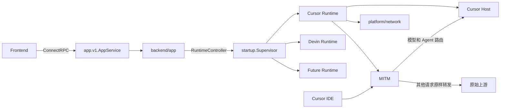

# 前后端 ConnectRPC 重构完整方案

## 1. 目标

本方案重构桌面端、前端、本机控制面、代理层和具体服务端实现之间的边界。

最终目标如下：

1. 前端业务通信全部使用 ConnectRPC，不再使用任何 Wails 业务 IPC。
2. `internal/startup` 只负责依赖组装、启动顺序、运行时注册和优雅退出。
3. 操作系统与 Wails 能力统一收敛到 `internal/platform`。
4. `internal/backend/app` 只负责产品级本机控制面。
5. Cursor 协议、Agent 和 Prompt 全部归 `internal/backend/cursor`。
6. Runtime 是通用服务运行时，不绑定 Cursor，也不使用“Cursor backend”作为领域名称。
7. 当前 Cursor Host 与 MITM 只是一个 Runtime 实现，未来可以并列注册 Devin 等实现。
8. Cursor Host 未处理的接口返回 `404`；代理层未命中的请求原样转发到原始上游。

## 2. 强制边界

### 2.1 禁止业务 IPC

前端禁止继续使用以下能力：

```text
@bindings
Call.ByName
Events.On
Events.Emit
application.NewService
```

Wails 只负责桌面应用生命周期和 WebView，不再承载配置、运行时、模型或事件等业务接口。

### 2.2 Runtime 不绑定 Cursor

`backend/app/runtime.go` 表达的是通用运行时用例：

- 列出可用运行时；
- 启动、停止和重启指定运行时；
- 查询状态和最近一次错误；
- 向前端发布运行时状态变化。

它不能出现以下设计：

```text
CursorBackend
StartCursor
StopCursor
CursorMITMStatus
```

Cursor Host、MITM 和系统代理的组合只存在于启动装配阶段，不进入 App 的通用 DTO。

## 3. 总体架构



## 4. 目标目录

```text
internal/
├── startup/
│   ├── bootstrap.go
│   ├── wiring.go
│   └── supervisor.go
│
├── platform/
│   ├── desktop/
│   │   ├── app.go
│   │   ├── window.go
│   │   ├── tray.go
│   │   └── browser.go
│   ├── filesystem/
│   │   ├── paths.go
│   │   └── migrate.go
│   ├── network/
│   │   └── system_proxy.go
│   └── update/
│       └── installer.go
│
├── backend/
│   ├── app/
│   │   ├── host.go
│   │   ├── module.go
│   │   ├── service.go
│   │   ├── snapshot.go
│   │   ├── events.go
│   │   ├── config.go
│   │   ├── runtime.go
│   │   ├── model.go
│   │   ├── update.go
│   │   ├── desktop.go
│   │   ├── repository.go
│   │   ├── proto/
│   │   │   ├── app_v1.proto
│   │   │   └── types_v1.proto
│   │   └── gen/appv1/
│   │
│   ├── cursor/
│   │   ├── module.go
│   │   ├── host.go
│   │   ├── prompt/
│   │   ├── llm/
│   │   ├── loop/
│   │   ├── store/
│   │   ├── transport/
│   │   ├── proto/
│   │   │   ├── agent_v1.proto
│   │   │   ├── aiserver_v1.proto
│   │   │   ├── from_extensions/
│   │   │   ├── extractor/
│   │   │   └── scripts/
│   │   └── gen/
│   │       ├── agentv1/
│   │       └── aiserverv1/
│   │
│   └── devin/
│       └── .gitkeep
│
└── proxy/
    ├── server.go
    ├── router.go
    ├── passthrough.go
    └── certificate.go
```

前端目标目录如下：

```text
frontend/src/rpc/
├── transport.js
├── appClient.js
├── watch.js
└── gen/
    └── appv1/
```

`backend/app` 保持单一扁平 Go package，不按配置、模型等功能继续拆子目录。只有 protobuf 源文件和生成代码保留独立目录。

## 5. 模块职责

### 5.1 `internal/startup`

`startup` 是唯一组合根，负责：

- 创建数据库连接；
- 执行各模块声明的迁移；
- 创建 App、Cursor、Proxy 和 Platform 实例；
- 注入模块依赖；
- 注册所有 Runtime 实现；
- 确定启动和停止顺序；
- 捕获退出信号并等待资源释放。

`startup` 不负责窗口、托盘、浏览器、系统代理命令等具体平台操作，这些能力必须通过 `platform` 注入。

### 5.2 `internal/platform`

`platform` 只包装本机和操作系统能力：

- `desktop`：Wails、窗口、托盘和浏览器；
- `filesystem`：数据目录、配置目录、日志目录和文件迁移；
- `network`：系统代理读取、设置和恢复；
- `update`：安装包验证与执行。

只有 `platform/desktop` 可以直接导入 Wails application API。`platform` 不依赖 protobuf、AppService 或 Cursor 协议。

### 5.3 `internal/backend/app`

App 是产品级本机控制面，负责：

- 产品配置；
- 通用 Runtime 控制；
- BYOK 模型配置和连通性测试；
- 应用更新状态；
- 受控桌面动作；
- App 快照和 App 事件流。

App 不负责：

- Cursor IDE 协议；
- MITM 实现；
- 具体 Runtime 的启停细节；
- 操作系统命令。

### 5.4 `internal/backend/cursor`

Cursor 模块拥有所有 Cursor 专属语义：

- Cursor Host 路由；
- Cursor Connect、Bidi 和 RunSSE 协议；
- Agent Loop、Prompt、LLM 和会话存储；
- Cursor 提取的 protobuf 和生成代码。

Cursor 不导入 `backend/app`。需要模型目录等通用数据时，由 Cursor 自己声明小接口，再由 `startup` 注入实现。

### 5.5 `internal/proxy`

Proxy 是通用代理基础设施，不导入 Cursor package。

Cursor 模块提供它能处理的路由集合，`startup` 将路由匹配器和目标地址注入 Proxy。未命中的请求必须保留原请求的 method、path、query、header、body 和流式响应语义，并发送到原始上游。

## 6. Runtime 设计

### 6.1 App 侧端口

`backend/app/runtime.go` 定义通用端口：

```go
// RuntimeController 管理已注册的服务运行时。
type RuntimeController interface {
	List(context.Context) ([]RuntimeDescriptor, error)
	Start(context.Context, string) error
	Stop(context.Context, string) error
	Restart(context.Context, string) error
	Status(context.Context, string) (RuntimeStatus, error)
}
```

Runtime DTO 只包含通用字段：

```text
RuntimeDescriptor {
  id
  kind
  state
  capabilities
  endpoint
  last_error
  revision
}
```

其中 `id` 标识一个配置实例，`kind` 标识实现类型，例如 `cursor` 或 `devin`。App 和前端不能根据 Cursor 专属字段决定运行时流程。

### 6.2 Supervisor

`startup/supervisor.go` 实现 `RuntimeController`，维护 Runtime 注册表和状态机：

```text
Stopped -> Starting -> Running -> Stopping -> Stopped
                     -> Failed
```

必须满足：

- 同一个 Runtime 的启停操作串行执行；
- 重复 Start 和 Stop 具有幂等语义；
- 启动中途失败时回滚已经启动的组件；
- Stop 按 Start 的逆序执行；
- 状态变化携带递增 revision；
- 应用退出时统一停止所有已启动 Runtime。

### 6.3 当前 Cursor Runtime

当前在 `startup/wiring.go` 注册一个 `kind=cursor` 的 Runtime。它的启动顺序为：

1. 校验 Cursor 和模型配置；
2. 启动 Cursor Host；
3. 启动 MITM；
4. 根据配置启用系统代理；
5. 发布 Running 状态。

停止时按相反顺序恢复系统代理、停止 MITM、停止 Cursor Host。

Cursor Host 和 MITM 是当前实现的内部组件，不应被命名为整个 Runtime。未来接入 Devin 时，只需注册新的 Runtime 实现，不修改 AppService 协议。

## 7. ConnectRPC 服务面

### 7.1 `app.v1.AppService`

第一阶段使用明确方法，不提供通用 JSON Invoke：

```text
Bootstrap
Watch
GetConfig
UpdateConfig
ListRuntimes
GetRuntime
StartRuntime
StopRuntime
RestartRuntime
ListModels
SaveModel
DeleteModel
TestModel
GetAds
GetUpdate
CheckUpdate
InstallUpdate
OpenWindow
OpenExternal
```

App 的 `Watch` 第一条消息是完整 App 快照，后续发送带 revision 的增量事件：

```text
snapshot
config_changed
runtime_changed
model_changed
ads_changed
update_changed
```

### 7.2 Cursor IDE 协议服务

Cursor IDE 使用独立 Host。该 Host 只注册：

- 模型列表接口；
- Agent BidiAppend 接口；
- Agent RunSSE 接口。

其他路径全部返回 `404`，不能做代理兜底。代理兜底只能发生在 Proxy 层。

## 8. 两个本地 Host

### 8.1 App Host

App Host 绑定随机回环地址 `127.0.0.1:0`，负责：

- 提供前端静态资源；
- 注册 AppService；
- 校验 Origin 和本地会话；
- 提供 ConnectRPC 流式响应。

桌面启动时生成一次性 bootstrap token。WebView 首次访问 bootstrap 地址后，Host 写入 `HttpOnly`、`SameSite=Strict` Cookie，并重定向到普通首页。前端代码不长期保存 token。

### 8.2 Cursor Host

Cursor Host 绑定 Cursor 配置要求的本机地址，只服务 Cursor IDE 协议。它与 App Host 使用不同的路由表和认证规则。

## 9. 前端架构

前端只保留 `appClient`，负责配置、Runtime、模型、更新和桌面动作。

启动流程如下：

1. 创建同源 Connect-Web transport；
2. 调用 AppService `Bootstrap`；
3. 启动 `Watch`；
4. 按 revision 丢弃重复或乱序事件；
5. 流断开后退避重连，并重新取得完整快照。

前端不导入 Wails runtime，也不通过全局事件总线传递后端状态。

## 10. 数据库与依赖注入

启动过程固定为：

1. `platform/filesystem` 解析数据路径；
2. `startup` 打开数据库连接；
3. App 和 Cursor 分别提供自己的迁移集合；
4. `startup` 按版本执行迁移；
5. 创建 App Repository 和 Cursor Repository；
6. 将接口注入对应 Service；
7. 注册 ConnectRPC Handler；
8. 启动 App Host 和桌面窗口。

模块只能访问自己拥有的表。跨模块调用使用接口，不共享数据库 DTO。

## 11. Proto 和生成代码

新建的产品控制协议位于：

```text
internal/backend/app/proto
internal/backend/app/gen
```

所有 Cursor 专属协议位于：

```text
internal/backend/cursor/proto
internal/backend/cursor/gen
```

当前根目录的 `proto`、`gen` 以及协议提取器都要迁入 Cursor 模块。提取器必须按 parser、symbols、renderer 等职责拆分，单文件禁止超过 500 行。

前端只生成 AppService 所需的 Web 客户端，不把 Cursor IDE 上游协议暴露给 UI。

## 12. 依赖方向

允许的依赖方向如下：

```text
main -> startup
startup -> platform
startup -> backend/app
startup -> backend/cursor
startup -> proxy

frontend -> app.v1

backend/app -> 自己声明的端口
backend/cursor -> 自己声明的端口
proxy -> 注入的路由和目标接口
```

禁止以下依赖：

```text
backend/app -> backend/cursor
backend/cursor -> backend/app
platform -> backend
platform -> protobuf
proxy -> backend/cursor
任何业务包 -> startup
```

## 13. 现有代码迁移映射

```text
internal/app/runner.go
  -> startup/bootstrap.go
  -> startup/wiring.go
  -> platform/desktop/*

internal/bridge/*
  -> 删除

internal/client 中的产品配置、模型、更新
  -> backend/app 对应文件

internal/appdata
  -> platform/filesystem

系统代理操作
  -> platform/network

更新状态与检查
  -> backend/app/update.go

安装命令
  -> platform/update/installer.go

根 proto、gen 和提取器
  -> backend/cursor/proto
  -> backend/cursor/gen
```

## 14. TDD 实施顺序

### 阶段一：建立架构守卫

先写失败测试，检查：

- 前端禁止的 Wails IPC 标识；
- App 与 Cursor 禁止互相导入；
- Wails application API 只能出现在 `platform/desktop`；
- 根目录不再存在 Cursor `proto` 和 `gen`；
- 所有手写源码不超过 500 行。

### 阶段二：建立 App ConnectRPC Host

先测试再实现：

- loopback 随机端口；
- bootstrap token 换取 Cookie；
- AppService unary 调用；
- Watch 首包快照和 revision；
- 非法 Origin 和无会话请求拒绝。

### 阶段三：实现通用 Runtime

使用两个 Fake Runtime 先验证：

- 注册和列出多个 kind；
- 幂等 Start 和 Stop；
- 并发操作串行化；
- 部分启动失败回滚；
- 逆序停止；
- 状态 revision；
- Cursor Runtime 和 Devin Runtime 不需要修改 AppService。

然后再把 Cursor Host、MITM 和系统代理接入 Cursor Runtime。

### 阶段四：切换前端

先为 RPC 状态层编写测试，再替换现有 bindings 和 Events。切换完成后删除 `internal/bridge` 与所有 Wails 业务服务注册。

### 阶段五：迁移 Cursor Proto

迁移 Cursor IDE 协议源文件、生成代码和提取器，并使用协议 fixture 验证迁移前后字节结果一致。

### 阶段六：清理和集成验证

删除旧接口、旧事件、旧生成代码和空目录，运行完整单元测试、集成测试、静态检查与编码风格检查。

## 15. 必须覆盖的测试

### App Host

- 首次 bootstrap 成功且 token 只能使用一次；
- Connect unary 和 server stream 可用；
- 重连后重新获得完整快照；
- Host 停止后连接和 goroutine 全部退出。

### Runtime

- 多种 Runtime 并存；
- 状态转换合法；
- Cursor 启动顺序正确；
- Cursor 停止顺序与启动相反；
- MITM 启动失败时 Cursor Host 被回滚；
- 应用退出时所有 Runtime 被停止。

### Cursor Host 与 Proxy

- 模型列表和 Agent 接口可访问；
- Cursor Host 的其他路径返回 `404`；
- Proxy 只拦截 Cursor Host 明确支持的路由；
- 其他请求的 method、path、query、header、body、status 和响应流保持透传语义。

### 前端

- 不存在 Wails bindings 和业务 Events；
- App 状态订阅只通过 AppService；
- 重复 revision 不会重复更新状态；
- 断流后可以恢复快照和订阅。

## 16. 完成标准

满足以下条件才算重构完成：

1. 前端业务链路全部经过 ConnectRPC。
2. `internal/bridge` 已删除。
3. `backend/app` 只包含产品级配置、Runtime 和桌面控制能力。
4. Runtime API、DTO、状态和测试均不绑定 Cursor。
5. Cursor Host 与 MITM 只作为已注册 Runtime 的当前实现。
6. Cursor 专属 proto、gen 和提取器全部位于 `backend/cursor`。
7. Cursor Host 未注册路径稳定返回 `404`。
8. Proxy 未命中请求稳定透传到原始上游。
9. 只有 `platform/desktop` 直接使用 Wails application API。
10. 所有新增和调整的源码、测试均使用简洁中文注释，单文件不超过 500 行。
