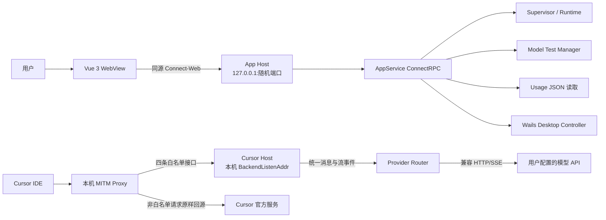
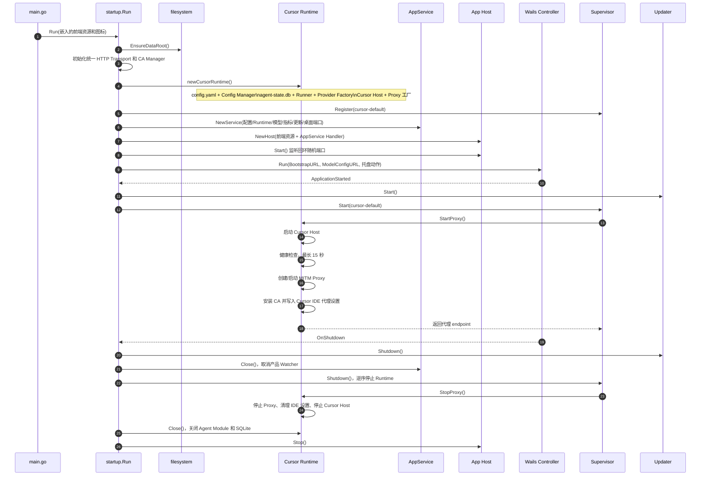
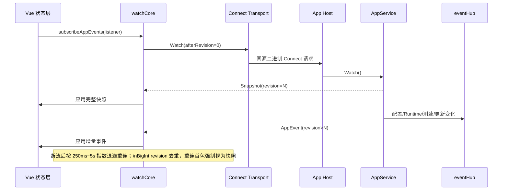
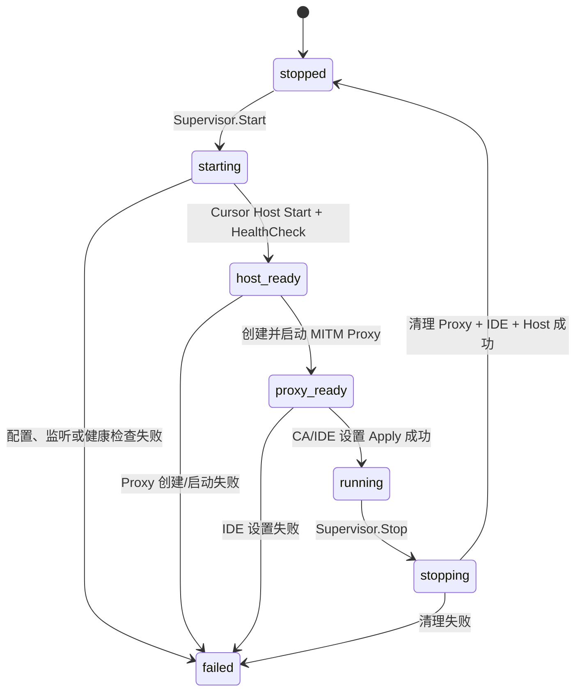
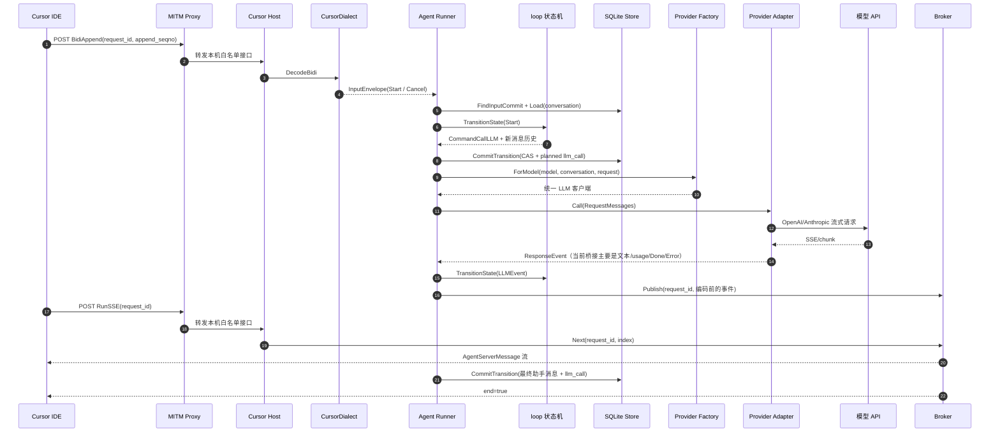
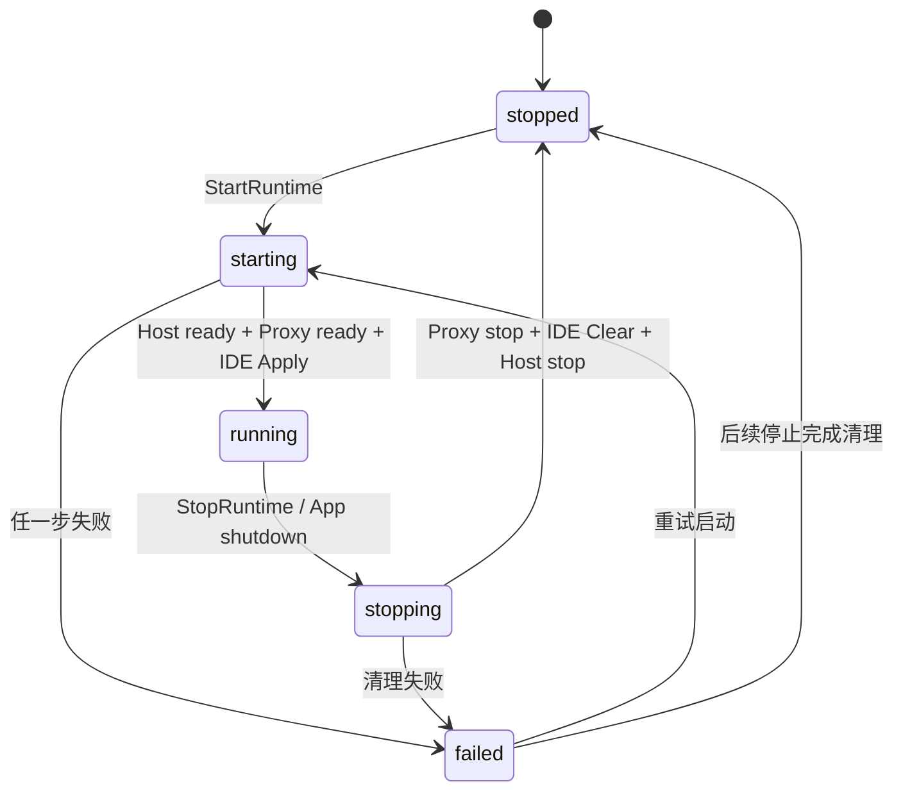

# cursor-byok 当前架构文档

> 基线：当前工作树，而不是历史提交或产品宣传文档。
>
> 更新时间：2026-08-10

## 1. 结论先行

当前项目是一个单进程、本地优先的 Wails 桌面应用。Go 进程同时承担三类职责：

1. 通过本机 App Host 向 Vue WebView 提供产品控制面；
2. 启动一个 Cursor Runtime，包含 Cursor Host、MITM 代理和 Cursor IDE 系统设置注入；
3. 把 Cursor 的本地协议请求转换为用户配置的 OpenAI/Anthropic 兼容模型请求。

当前主进程只注册一个 `cursor-default` Runtime。旧架构中的 Cursor 账号控制面、广告服务和广告资源路由已经从当前工作树移除，不应再作为现状组件绘制。`cursor-tab-server` 仍是独立的命令行程序，不由桌面进程创建。

## 2. 系统上下文



### 2.1 进程内边界

```text
main.go
  └─ startup.Run（组合根）
       ├─ platform/desktop       Wails 窗口、托盘和系统动作
       ├─ backend/app             产品控制面、快照和 Watch
       ├─ backend/cursor          Cursor Runtime、协议循环和模型链路
       ├─ proxy                   MITM、证书和请求转发
       ├─ modeltest               模型列表与连通性测试
       ├─ historymetrics           usage.json 统计读取
       ├─ updater                 更新检查、下载和安装
       └─ platform/*              文件系统、系统代理、证书与平台适配
```

`backend/app` 只依赖产品级端口（配置、Runtime、模型测试、指标、更新、桌面动作）；具体实现由 `internal/startup` 的适配器注入。Cursor 协议实现位于 `backend/cursor`，不能让前端或 AppService 直接依赖其 Protobuf/Provider DTO。

## 3. 组合根与启动顺序

`internal/startup/bootstrap.go` 是唯一组合根，拥有长期资源并决定释放顺序。



启动过程失败时，Runtime 按已完成步骤逆序回滚。Supervisor 对同一个 Runtime 使用串行操作锁，重复 Start/Stop 不会并发交错。桌面事件循环退出后，`Run` 仍会再次调用幂等 `shutdown`，确保命令行异常退出和窗口退出都能释放资源。

## 4. 产品控制面

### 4.1 App Host

`internal/backend/app/host.go` 把静态前端和 AppService 放在同一个回环 HTTP 服务中：

- 默认监听 `127.0.0.1:0`，实际端口由系统分配；
- `/bootstrap?token=...` 只允许一次 GET，用一次性 token 换取会话 Cookie；
- Cookie 为 `HttpOnly`、`SameSite=Strict`，后续请求必须携带；
- 请求还要通过 Host Origin 校验，只允许空 Origin 或当前回环 Host；
- SPA 未命中静态文件时回退到 `/`；
- 当前只挂载 `/app.v1.AppService/`。

### 4.2 AppService API 分组

定义文件为 `internal/backend/app/proto/app_v1.proto`，当前 API 可按职责分为：

| 分组 | RPC |
| --- | --- |
| 首屏与状态 | `Bootstrap`、`Watch` |
| 配置 | `LoadConfig`、`SaveConfig` |
| Runtime | `ListRuntimes`、`GetRuntime`、`StartRuntime`、`StopRuntime`、`RestartRuntime` |
| 模型 | `TestModelAdapter`、`GetModelAdapterTestResults`、`FetchModelAdapterModels` |
| 指标与应用信息 | `GetHomeMetrics`、`GetAppInfo` |
| 桌面动作 | `OpenPath`、`OpenExternal`、`SetLocale`、`ControlWindow` |
| 更新 | `CheckForUpdates`、`InstallReadyUpdate` |

Service 层只做请求校验、端口调用、领域错误到 Connect 错误的映射和 DTO 转换。配置、Runtime、测速和更新的并发/持久化责任分别留在对应实现中。

### 4.3 快照与 Watch

服务端 `eventHub` 为事件分配全局递增 `revision`。`Watch` 每次连接先发送完整 `BootstrapResponse` 快照，随后发送配置、Runtime、模型测试和更新事件。慢订阅者无法及时消费时会被断开，客户端通过重连重新获取快照，而不是在服务端保留无限事件队列。



前端另外保留 `localStorage` 作为启动缓存，但后端配置和 Runtime 快照才是运行时事实来源。当前 `bootstrapAppState` 仍会分别调用配置、测速、版本、Runtime 和指标 RPC；Watch 流用于持续同步变化。

## 5. 前端结构

```text
frontend/src/
  main.js                 Vue、路由、i18n 和初始状态启动
  layouts/MainLayout.vue  桌面主布局
  views/Home.vue          服务状态、首页指标和更新入口
  views/Config.vue        通用应用配置
  views/ModelConfig.vue   模型渠道管理
  components/             模型编辑、测速卡片、指标卡和 UI 基础组件
  rpc/                    Connect-Web Transport、App Client、Watch 重连
  services/clientApi.js  页面语义到 RPC 的薄封装
  state/                  响应式状态、配置规范化、用户动作和派生视图
  i18n/                   zh-CN/en-US/ja-JP/ru-RU 运行时国际化
```

模型配置编辑器支持 OpenAI/Anthropic 类型、端点、密钥、模型 ID、推理/思考参数、额外 JSON 参数、自定义请求头、排序、复制、删除、批量测速和供应商模型列表拉取。保存前由前端校验，再通过 `SaveConfig` 完整提交；后端 `configAdapter` 只合并 AppService 定义的字段。

## 6. Runtime 与 MITM

### 6.1 Supervisor 状态

通用 Runtime 状态为 `stopped → starting → running → stopping → stopped`，失败进入 `failed`。当前注册项为：

```text
id:           cursor-default
kind:         cursor
capabilities: agent, models, proxy
```

`RuntimeDescriptor.Endpoint` 对前端只暴露代理 endpoint。前端的 `runtimeToLegacyState` 把它投影为 `backendRunning/proxyRunning/serviceRunning` 等旧页面字段，因此 UI 看到的是兼容视图，而不是 Cursor Runtime 的全部内部状态。

### 6.2 Cursor Runtime 内部步骤



Host 使用配置中的 `BackendListenAddr`，Proxy 使用 `ProxyListenAddr`。代理目标固定为本机 Cursor Host；Runtime 明确拒绝通过外部接口绕过 Host 修改 `baseURL`。若 Proxy 监听地址发生变化，必须先停止运行中的服务，再创建新代理实例。

### 6.3 请求分流

`internal/backend/cursor/routes/routes.go` 是当前路由事实源。仅当请求同时满足以下条件时，MITM 才把请求转发到本机 Cursor Host：

- CONNECT 目标是 `cursor.sh` 或其子域名；
- 请求方法是 POST；
- 路径属于四个白名单接口：

```text
/aiserver.v1.AiService/AvailableModels
/aiserver.v1.AiService/GetUsableModels
/aiserver.v1.BidiService/BidiAppend
/agent.v1.AgentService/RunSSE
```

其余请求保持原请求回源，代理不读取 body、不改写 URL/headers。MITM 使用内置 CA 动态签发目标站点证书，并缓存按主机生成的证书；HTTP 客户端经过 `netproxy.NewTransport`，统一遵守环境变量和系统代理设置，同时绕过 localhost/127.0.0.1/::1。

## 7. Cursor Agent 执行链



### 7.1 协议入口实际支持范围

- `BidiAppend` 解码 `AgentClientMessage`；当前 Dialect 接受用户消息启动回合和取消动作，但取消消息没有携带 `ConversationID`，进入 Runner 后会落到缺少会话标识的错误路径。
- `RunSSE` 按 `request_id` 从 Broker 顺序消费，直到结束事件或错误。
- `AvailableModels`/`GetUsableModels` 从配置渠道生成 Cursor 需要的模型目录。
- Runner 对同一 `conversationID` 加互斥锁；输入按 `conversationID + inputID` 去重。
- 状态提交使用 SQLite version CAS，模型调用的 planned/final 事实与会话提交放在同一事务边界。

### 7.2 当前工具链边界

当前代码已经定义了工具、thinking、图片、usage 和供应商 tool-call 事件的数据模型，OpenAI/Anthropic 适配器也包含 thinking/工具调用流解析与参数累积逻辑。但桌面主链路仍有两个明确限制：

1. `internal/backend/cursor/provider/provider.go` 创建 `StreamRequest` 时把 `Tools` 固定为 `nil`，并且只把文本、思考内容和工具结果文本投影到 Provider Message，助手 ToolCall 不会进入上游请求；
2. Provider bridge 当前只消费 `ModelEventKindTextDelta` 和 `ModelEventKindTurnFinished`，没有把 thinking/tool 事件转换成 `ResponseEvent`；`CursorDialect` 虽定义了对应编码分支，实际主链路拿不到这些事件，`Runner.runCommand` 也没有执行 `CommandCallClient`。

因此当前“有效运行闭环”是用户文本生成、usage、完成和错误收口；thinking、工具调用和取消属于已建模或已接入口但尚未形成可靠端到端闭环的扩展面，不能在架构图中标成已完成能力。

## 8. 模型 Provider 层

```text
Runner
  → provider.Factory.ForModel
  → llm/adapter.Router
  → store/config.Manager.SelectChannelForModel
  → OpenAIAdapter 或 AnthropicAdapter
  → 用户配置的 BaseURL + API Key
```

Router 根据 Cursor 请求中的模型 ID 选择渠道，并注入：

- provider 类型、BaseURL、API Key、真实上游模型 ID；
- OpenAI Responses/Chat Completions 端点和推理强度；
- Anthropic thinking/max_tokens/额外参数；
- 自定义请求头、provider 流空闲超时、上下文窗口和输出限制。

适配器负责请求体构造、SSE 解码、thinking 标签/签名处理、工具调用参数增量、usage 归一化、重试和空闲超时。`modeltest.Manager` 是独立的测试通道，不复用 Agent Runner 的会话状态。

## 9. 配置、存储和数据流

### 9.1 配置边界

配置文件为 `~/.cursor-local-assistant-v2/config.yaml`。`store/config.Manager` 负责规范化、原子快照、保存通知和热加载；`startup/config_adapter.go` 把内部配置投影为 AppService 的 `UserConfig`。

AppService 公开的配置包括日志开关、provider 流空闲超时、模型渠道和首页缓存命中率口径。监听地址、运行时私有字段由 Cursor 配置管理器保留；前端仍有少量旧字段缓存，但它们不属于当前 AppService Protobuf 合同。

### 9.2 SQLite 事实模型

数据库路径为 `~/.cursor-local-assistant-v2/history/agent-state.db`，当前迁移创建：

| 表 | 作用 |
| --- | --- |
| `conversations` | 版本化会话状态、消息历史和等待客户端信息 |
| `input_commits` | 输入幂等提交和可重放结果 |
| `llm_calls` | 精确请求、请求哈希、消息哈希和调用状态 |
| `client_operations` | 工具客户端操作事实模型（当前执行链尚未完整使用） |
| `stream_diagnostics` | 可选流诊断事件，不回写模型历史 |

模型流期间的 delta 保存在内存中的 `PendingResponse` 和 Broker；只有回合收口后的助手消息才追加到 `ConversationState.Messages`。这是保持历史 append-only 和 provider prompt cache 稳定性的关键约束。

### 9.3 文件与平台资源

| 路径 | 内容 |
| --- | --- |
| `config.yaml` | 产品/模型配置 |
| `history/agent-state.db` | Agent 会话和调用事实 |
| `history/usage.json` | 首页用量摘要 |
| `logs/app-YYYY-MM-DD.log` | 按本地日期切换的结构化日志文件，权限 0600 |
| `data/ca.crt` | 注入系统和 Cursor 的 CA 文件 |
| Cursor `state.vscdb` | Runtime 启动时同步本地模拟用户信息并关闭绕过代理的实验开关 |

## 10. 桌面外壳、更新与观测

Wails `Controller` 只负责窗口、托盘、外部浏览器、白名单目录和语言同步，不承载模型业务。主窗口默认加载 App Host 的 bootstrap URL；模型配置窗口加载同一 Host 的 `/model-config` 路由。

更新管理器在 Wails 应用启动后开始后台检查，状态通过 AppService Watch 的 `UpdateChanged` 事件到达前端；安装动作委托平台 Installer，完成后通过桌面控制器退出应用。

日志层当前使用 `slog` + `charm.land/log/v2`：控制台输出彩色信息日志，文件输出 logfmt；标准库 `log` 被转接到统一门面。代理连接/TLS/转发错误带有按错误特征的时间窗口限流，避免大量重复错误淹没日志。

## 11. 生命周期和失败处理



启动预算和回滚策略：

- Cursor Host 单次健康检查超时 1 秒，整体等待预算 15 秒；
- Runtime 启动失败时停止已经启动的 Proxy 和 Host；
- 停止顺序为 Proxy → 清理 Cursor IDE/system proxy → Cursor Host；
- 进程退出时再关闭 Transport Module、SQLite、Supervisor、Updater 和 App Host；
- Provider 流、Agent 任务和 Broker 在 Module.Close 时通过运行域 context 统一取消。

## 12. 当前工作树中必须关注的事实与风险

### 已确认的现状

- 当前主进程只有 AppService 控制面；账号、广告相关 Go 包、Proto、前端组件和 RPC 客户端均已删除。
- 当前 Runtime 注册表仍为可扩展的多 Runtime 抽象，但实际只注册 Cursor 一个实例。
- Provider 适配器覆盖 OpenAI Responses/Chat Completions 和 Anthropic Messages，支持 thinking、usage、部分工具事件解析。
- Agent Dialect/Runner 仍是受限 MVP：主要闭环为用户消息 → 模型流 → 文本下行 → usage/完成或错误；thinking、工具结果和取消仍有桥接缺口。
- 首页指标适配器只读取 `history/usage.json`；当前仓库没有对应写入器，新安装环境会得到空指标，除非该文件由外部或尚未合入的链路生成。
- `cursor-tab-server` 是独立 Go module，使用固定 Cursor Tab 上游路径和 YAML token，不共享桌面进程的 Host、Cookie 或 Runtime。

### 当前验证阻塞

本次分析执行了后端相关测试，但当前工作树的 `go.mod` 已移除 `charm.land/log/v2` 直接依赖，而 `internal/logger/logger.go` 仍导入该包，因此 `go test` 在编译 cursor/proxy/startup 相关包时失败。该依赖不一致属于工作树现状，文档没有擅自修改。

## 13. 演进建议

1. 先打通 Provider → Runner → Dialect 的工具闭环：传递 `Tools`、保留助手 ToolCall、发布 Cursor 工具事件、接受工具结果，再驱动下一轮 `CommandCallLLM`。
2. 在 `AppService` 错误边界引入稳定领域错误类型，减少当前基于错误文本的 Connect code 判断。
3. 将前端旧的监听地址缓存字段从状态合同中清理，避免用户误以为可以通过产品配置修改 Runtime 拓扑。
4. 为 Runtime、Proxy、Runner、Provider 调用统一注入 request/conversation/call trace ID，打通结构化日志、SQLite 和性能测试结果。
5. 修复依赖锁定后再执行 `go test ./...`、前端 RPC 测试和跨平台构建；协议生成任务继续以 `build/Taskfile.yml` 为唯一入口。

## 14. 关键源码索引

| 主题 | 入口 |
| --- | --- |
| 进程入口 | [`main.go`](../main.go) |
| 组合根 | [`internal/startup/bootstrap.go`](../internal/startup/bootstrap.go) |
| Runtime 管理 | [`internal/startup/supervisor.go`](../internal/startup/supervisor.go) |
| AppService 合同 | [`internal/backend/app/proto/app_v1.proto`](../internal/backend/app/proto/app_v1.proto) |
| AppService 实现 | [`internal/backend/app/service.go`](../internal/backend/app/service.go) |
| App Host 认证与 SPA | [`internal/backend/app/host.go`](../internal/backend/app/host.go) |
| App 事件与快照 | [`internal/backend/app/events.go`](../internal/backend/app/events.go)、[`internal/backend/app/snapshot.go`](../internal/backend/app/snapshot.go) |
| Cursor Host | [`internal/backend/cursor/host.go`](../internal/backend/cursor/host.go) |
| Cursor Runtime 生命周期 | [`internal/backend/cursor/runtime_lifecycle.go`](../internal/backend/cursor/runtime_lifecycle.go) |
| MITM 分流 | [`internal/proxy/router.go`](../internal/proxy/router.go)、[`internal/proxy/passthrough.go`](../internal/proxy/passthrough.go) |
| 路由事实源 | [`internal/backend/cursor/routes/routes.go`](../internal/backend/cursor/routes/routes.go) |
| Agent 传输 | [`internal/backend/cursor/transport/handler.go`](../internal/backend/cursor/transport/handler.go)、[`internal/backend/cursor/transport/cursor_dialect.go`](../internal/backend/cursor/transport/cursor_dialect.go) |
| Agent 状态机 | [`internal/backend/cursor/loop/transition.go`](../internal/backend/cursor/loop/transition.go) |
| Agent 协调器 | [`internal/backend/cursor/agentrun/runner.go`](../internal/backend/cursor/agentrun/runner.go) |
| Provider 路由 | [`internal/backend/cursor/llm/adapter/router.go`](../internal/backend/cursor/llm/adapter/router.go) |
| Provider 桥接 | [`internal/backend/cursor/provider/provider.go`](../internal/backend/cursor/provider/provider.go) |
| SQLite 持久化 | [`internal/backend/cursor/store/sqlite.go`](../internal/backend/cursor/store/sqlite.go)、[`internal/backend/cursor/store/conversations.go`](../internal/backend/cursor/store/conversations.go) |
| 前端 RPC 与重连 | [`frontend/src/rpc/watchCore.js`](../frontend/src/rpc/watchCore.js)、[`frontend/src/services/clientApi.js`](../frontend/src/services/clientApi.js) |
| 前端状态 | [`frontend/src/state/appState.js`](../frontend/src/state/appState.js)、[`frontend/src/state/appActions.js`](../frontend/src/state/appActions.js) |
| 日志与按日文件 | [`internal/logger/logger.go`](../internal/logger/logger.go)、[`internal/logger/daily_file.go`](../internal/logger/daily_file.go) |
| 构建与协议生成 | [`Taskfile.yml`](../Taskfile.yml)、[`build/Taskfile.yml`](../build/Taskfile.yml) |
